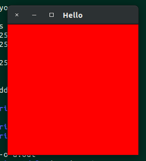

環境は `Ubuntu 18.04.3 LTS x86_64` です．

# 必要なパッケージを入れる

```console
$ sudo apt install freeglut3-dev
```

# 試す

なんか適当に

```c
#include <stdlib.h>
#include <GL/glut.h>
#include <GL/gl.h>
#include <GL/glu.h>

static void display(void)
{
    glClear(GL_COLOR_BUFFER_BIT);
    glFlush();
}

int main(int argc, char **argv)
{
    glutInit(&argc, argv);
    glutInitWindowSize(256,256);
    glutCreateWindow("Hello");
    glClearColor(1, 0, 0, 1);
    glutDisplayFunc(display);
    glutMainLoop();
    return 0;
}
```

256x256 のウィンドウを赤く塗りつぶすだけです．

で，コンパイル

```console
$ gcc main.c -lglut -lGLU -lGL -lm
```

できました．



# 適当に Makefile にしておく

ライブラリが多くて毎回指定するのは面倒なので， Makefile 必須っぽいです．

```makefile
LDFLAGS = -lglut -lGLU -GL -lm

.PHONY: all
all: main.o
	$(CC) main.o $(LDFLAGS)
```

# Man よこせ

```console
$ sudo apt install opengl-4-man-doc
```

で入るみたいです．でも見た感じ， `gl` で始まる関数しかないっぽい．
まあパッケージ名から想像がつくけど．

`glut` とか `glu` とかの man の入手の仕方を教えてください．

# さいごに

Windows でやる方がめんどくさいな，という印象ですね．まあ NuGet を使えば一発で入ることは入るんですが．
でもあれはプロジェクトごとになるのであまり好きではない．
