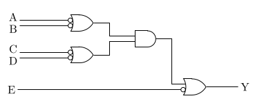

TikZ を使い始めて間もないのであまりきれいに書けていないかもしれない。

ゲートを自分でゴリゴリ描く必要はなくて，そういった図形は提供してくれている。

プリアンブルに以下を書く。

```tex
\usepackage{tikz}
\usetikzlibrary{shapes.gates.logic.US}
```

で回路図を書くのは以下。

```tex
\begin{tikzpicture}
  \path
  (2, 3) node[or gate US,logic gate inputs={inverted,inverted},draw](A1){}
  (2, 2) node[or gate US,logic gate inputs={inverted,inverted},draw](A2){}
  (4, 2.5) node[and gate US,logic gate inputs={normal, normal},draw](A3){}
  (5.5, 1) node[or gate US,logic gate inputs={normal,inverted},draw](O1){};

  \draw
  (A1.input 1) -- ++(-1.5, 0) ++(-0.2, 0.1) node {A}
  (A1.input 2) -- ++(-1.5, 0) ++(-0.2, -0.1) node {B}
  (A2.input 1) -- ++(-1.5, 0) ++(-0.2, 0.1) node {C}
  (A2.input 2) -- ++(-1.5, 0) ++(-0.2, -0.1) node {D}
  (A1.output) -- ++(0.5, 0) |- (A3.input 1)
  (A2.output) -- ++(0.5, 0) |- (A3.input 2)
  (A3.output) -- ++(0.5, 0) |- (O1.input 1)
  (O1.input 2) -- ++(-5.05, 0) ++(-0.2, 0) node {E}
  (O1.output) -- ++(1, 0) ++(0.2, 0) node {Y};
\end{tikzpicture}
```



入力を反転することもできて，`inputs` に `inverted` を入れれば良い。
また，縦に描画したい場合は `rotate=270` とかする。

各入力と出力には名前がついていて，`ゲートに付けた名前.input 入力の順番` と言った感じで
入力，出力からの線を簡単に描画できる。

また，これは TikZ の基本的なところだが，`++(x, y)` という感じで書くと前の座標から相対的に座標を決定できる。

### 追記

大文字小文字が間違っていたので ~警察が来るのを防ぐため~ 修正。LaTeX といい TikZ といい，
なんで奇妙な綴りをするのか……。
