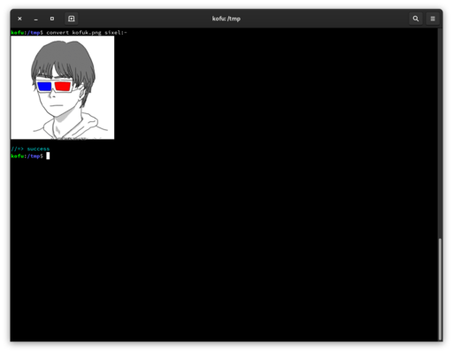

### 2021/8/10 追記

ちゃんとマージされていたので、それを入れる方法を[こちら](/blog/20210803-vte-sixel/)に書きました。

---

知らんけど。

なんか今作業中っぽいやつを適当に clone してきてビルドして使ってみた。

ビルドしてインストールされてる GNOME 端末で使う方法を適当に紹介。
ライブラリとかは適当に入れてください。僕は gobject-introspection
と vala を追加で入れる必要があった。Ubuntu とかだとヘッダファイルも
入れないといけない気がする。

1. ソースを落としてくる。僕はここから持ってきた。 https://gitlab.gnome.org/hansp/vte/-/tree/sixel-v5-hpj （けどこれはマージされてもマージされなくても消えるはず）
1. `meson _build` とかしてビルド用のディレクトリに ninja でビルドするファイルを生成する。
1. `ninja -C _build -j8` でビルド。`-j` オプションはコア数に合わせるとたぶん良い。
1. なんかエラーが出たので適当にエラーが出ないように修正。フォーマット文字列と型が一致しないとかだった。
1. `_build/src/` に libvteなんとかかんとかというファイルが生成されているのでリンクじゃないどれかを`/usr/lib`にコピーする。
1. `/usr/lib/libvteなんとかかんとか.so.0`のシンボリックリンクをさっきコピーしたライブラリを指すように張り直す。

`/usr/lib`にコピーしなくても `LD_LIBRARY_PATH` の通ってるディレクトリに置けばいい気はするけど
`/tmp` で作業したのとめんどくさかったのとでこういう感じにした。

あ，ABI 互換が保証されてないバージョンを使ってる場合はシンボリックリンク書き換える方法じゃだめですよ！！（念の為）

で，動かしたところいい感じに動いている感じがする。

まあ前からあったパッチをごにょごにょといじって作っているらしいので動くようにできるところは
新しくはないかも。

メリットとしては `xdg-open` で画像を別ウィンドウで開かなくても中身を見られるという
メリットがあります（弱い）。

bugzilla とかを眺めていたところ qemu の表示部分を sixel にして
[Windows XP を端末上で動かしている猛者がいた](https://youtu.be/X6M5tgNjEuQ)。
こういう用途もあるんだな（ない）。

あと screen が対応してくれないと screen に入ったら sixel が使えないという問題がある。
まあこれは単に terminfo の問題かもしれんけど。
