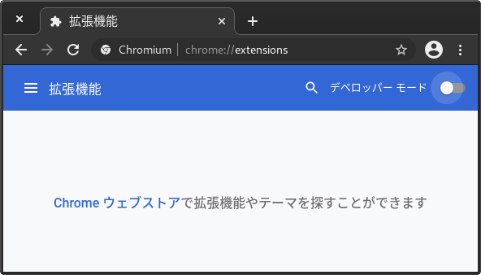
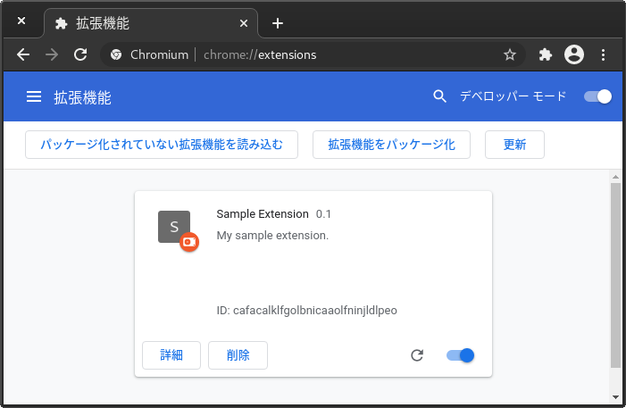
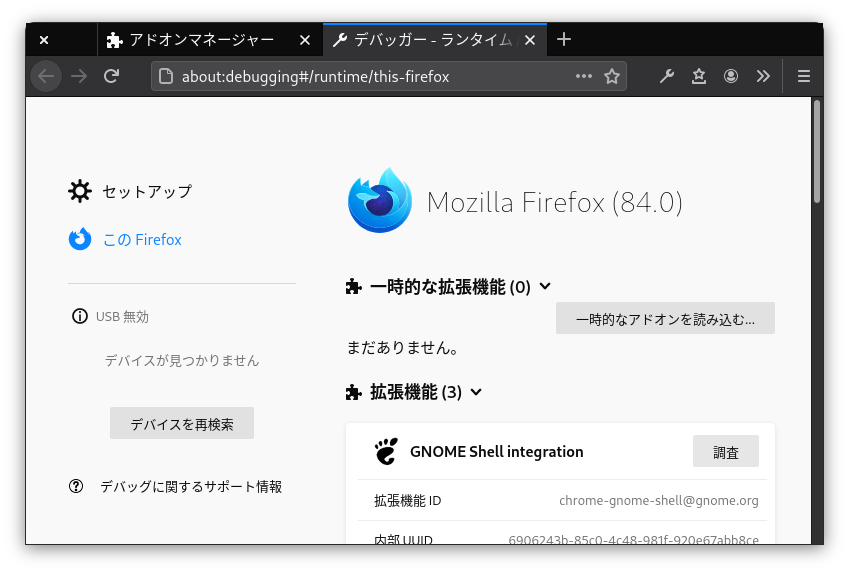
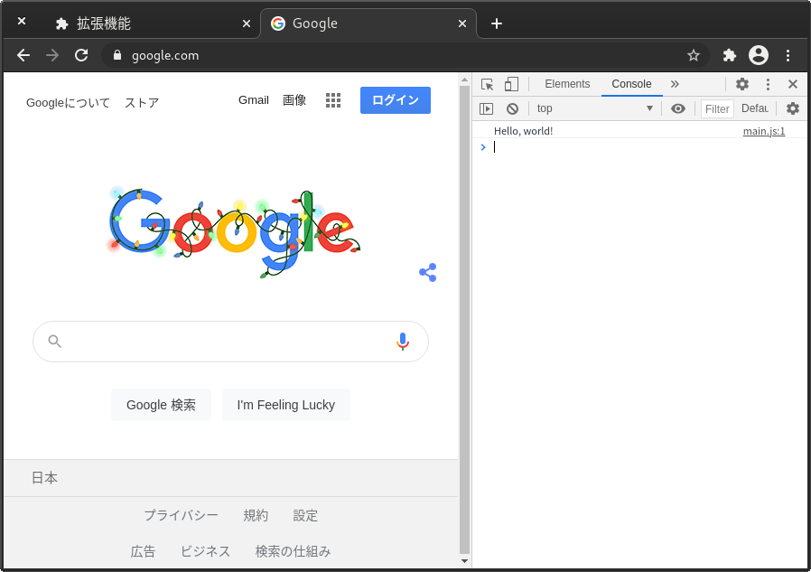
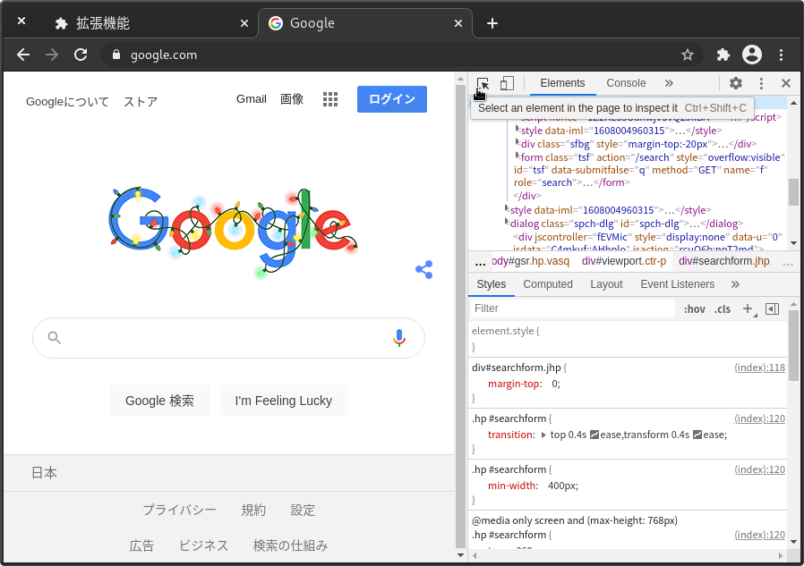
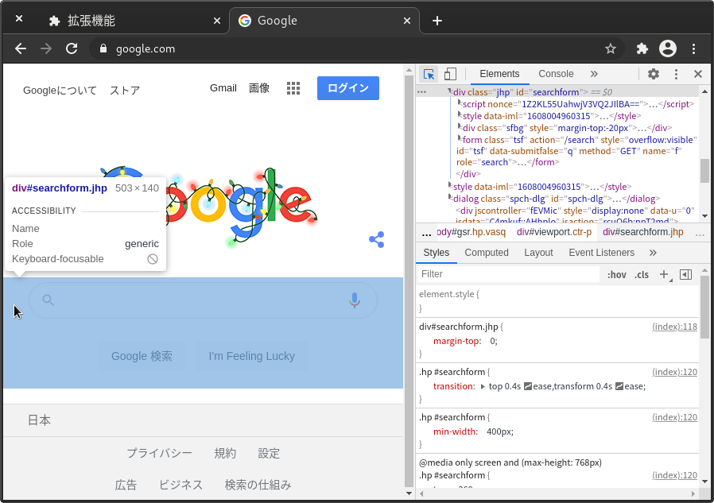
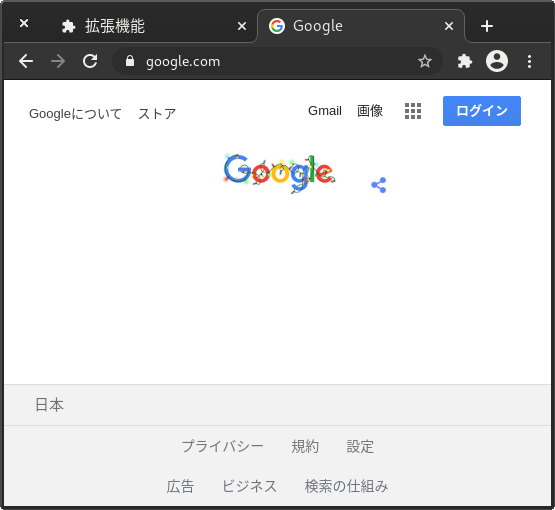
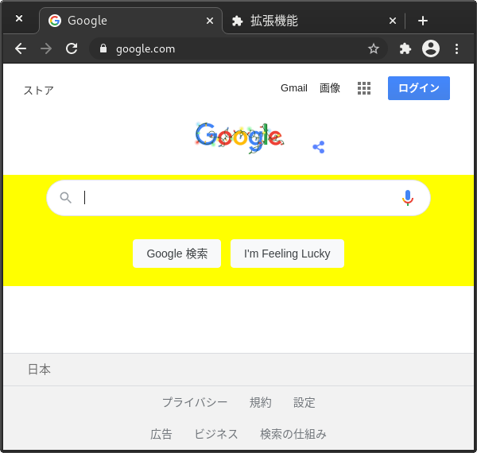
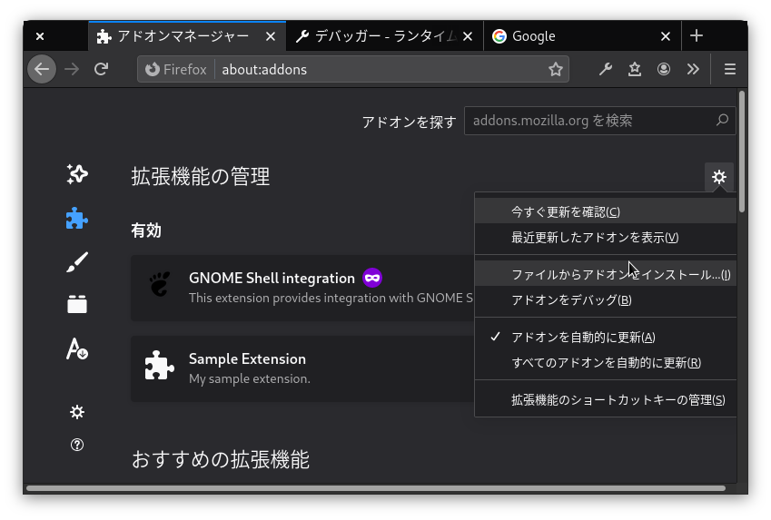


この記事は「[ョョョねこ Advent Calendar 2020](https://adventar.org/calendars/5281)」
12日目の記事です。


「ョョョねこ Advent Calendar」なのにねこも VRChat も関係ない記事でいいのかなと
思いつつ、説明見た感じだと記事のテーマは割となんでもいいっぽかったので (言い訳) 12日目を
担当することにしました。
とか言ってたら 3 日も過ぎてました。すみません……。

突然ですが、いつも使っていた Web サイトに突然いらない機能が追加されて「あー、この表示消したいなー」
とか思うことありますよね。(え？ない？)  
そういうときに適当にブラウザ拡張を作って Web ページを勝手にカスタマイズしてしまおうというのがこの
記事の趣旨です。
多少の JavaScript の知識を前提として書きますが、JavaScript が分からなくても
この記事の中のサンプルコードを少し編集するだけでも簡単なブラウザ拡張が作れるように書いたつもりです。

この記事で「ブラウザ拡張」として言及するものは Chrome では「拡張機能」、Firefox では「アドオン」
として実装されているものです。
2017年ごろまでは Firefox は Chrome とは別の拡張機能用の API を持っていましたが、
今では Chrome と互換性のある WebExtensions API を使って拡張機能を開発することができます[^1]。
(とはいえ完全に同一ではないので多少のデバッグと修正が必要にはなりますが)。

僕はこの API を使って Google 検索の結果から無意味な Stack Overflow を翻訳しただけの記事や
某塾のページを除外するブラウザ拡張を作ったりしました (ただ、Google 検索の結果ページのレイアウト
は割と変わるので労力に見合わない部分もある (というか悲しいかなもはや動かない))。

まあその部分は仕方ないのでそこは割り切りということで早速作っていきましょう。

## 準備

ブラウザごとの拡張機能のストア以外から拡張機能をインストールするためには
事前にブラウザごとに異なる手順でその機能を有効にする必要があります。

### Chrome の場合

Chrome の場合は割と簡単にこの機能を有効にすることができます。

まず、アドレスバーに `about:extensions` と入力し、拡張機能の管理画面を開きます。



そして右上の「デベロッパー モード」のスイッチをオンにします。

これで準備完了です。

### Firefox の場合

Firefox では Chrome の場合と同じように簡単な手順ではストアからの拡張機能をインストールすることはできません。
(正確には Mozilla の署名がない拡張機能をインストールすることができない)。
正確にはできるのですが、デバッグ用にしかインストールできす、ブラウザを再起動すると消えてしまうのでブラウザを
起動するたびに再インストールが必要になってしまいます。

Firefox で署名のない拡張機能をインストールするには
[Firefox Developer Edition](https://www.mozilla.org/ja/firefox/developer/)
を使う必要があります。

## マニフェストを作る

拡張機能を作り始める前にその拡張機能専用のディレクトリを作る必要があります。
名前は何でもよいのですが、他のファイルがない新しいフォルダを用意する必要があります。
ブラウザに拡張機能を認識させるためには JSON 形式のマニフェストファイルを作ることになっています。

以下に例を示します。

```json
{
  "manifest_version": 2,

  "name": "Sample Extension",
  "description": "My sample extension.",
  "version": "0.1",

  "content_scripts": [
    {
      "matches": [
        "https://www.google.com/*"
      ],
      "js": ["main.js"]
    }
  ]
}
```

Firefox で署名せずに拡張機能をインストールしたい場合は以下のようなキーを含める必要があります。
これは`id` で拡張機能を区別し[^3]、別の拡張機能には別の `id` をつける必要があります。
Mozilla は id を [UUID](https://ja.wikipedia.org/wiki/UUID) またはメールアドレスのフォーマットで
つけるように求めています。ここでは `uuidgen` コマンドで生成した UUID で ID をつけています。

```json
  "applications": {
    "gecko": {
      "id": "{4e063709-1157-4486-9ad4-a0085add5059}"
    }
  }
```

各要素について説明します。

`manifest_version` は今のところ常に `2` ですが、最近 Google が `manifest_version` を
3 にする動きがある[^2]ので、近い将来 `3` にする必要があるかもしれません。

`name` はその名の通り拡張機能の名称です。この名前がブラウザの拡張機能リストに表示されます。

`description` は拡張機能の説明で、これも拡張機能のリストに表示されます。

`version` は拡張機能のバージョンで、Firefox では必須でないようですが、Chrome では必須のようです。

`content_scripts` は URL と実行する JavaScript のファイルの組で、`matches` にマッチする
URL にアクセスした際に `js` に列挙したファイルが実行されます。JavaScript ファイルを実行する方法は
他にもあるのですが、長くなるのでここでは書きません。ここでは `https://www.google.com/`
にある任意の URL (つまり `https://www.google.com/foo`や `https://www.google.com/bar/baz/`
などなど) にアクセスした際に `main.js` が実行されます。

## JavaScript で拡張機能本体を書く

`https://www.google.com/` の任意のファイルにアクセスしたときに `main.js` を実行することにしたので、
`main.js` に何か書いてブラウザにインストールし、Google にアクセスすると拡張機能が動作することになります。

まずは単純にログを出すだけの拡張機能を書いてみましょう。

`main.js` に以下の内容を書きます。

```js
console.log('Hello, world!');
```

そしてブラウザにインストールします。今回はデバッグ用にインストールするのでインストールする前に
特別な手順は必要ありません。

Chrome の場合は `chrome://extensions` にアクセスして「デベロッパー モード」に切り替えた後
「パッケージ化されていない拡張機能を読み込む」ボタンをクリックし、
拡張機能のファイルを置いたフォルダを選択します。すると以下のようにさきほど作った拡張機能が
リストに表示されます。拡張機能のファイルを編集した場合は右下の更新ボタンを押せば再読み込みされます。
「詳細」ボタンを押すとシークレットタブでも実行できるように設定できたりします。



Firefox の場合は `about:addons` にアクセスし、右上の歯車のアイコンから「アドオンをデバッグ」を
選択してデバッグ用にアドオンをインストールする画面を開きます。



開いた画面で「一時的なアドオンを読み込む」ボタンをクリックし、さきほど作った `manifest.json` か
`main.js` のどちらかを選択します。


F12 を押して開いた画面で「Console」というタブを選ぶと、"Hello, world!"
と出力されているのが分かると思います。画像は Chrome ですが、Firefox でも F12 を押して「コンソール」タブを
選ぶと同じように出力されています。



次に、Google のページで検索欄がいらないと思ったとします。これを消してみましょう。

「Elements」タブを開き、左上のアイコンを押します。



そして、検索欄の要素を探します。



これをクリックしたときに右側でも対応する部分が選択されます。選択された部分を見ると `id="searchform"`
という文字が見えます。この `searchform` という名前を使って JavaScript でこの要素を消します。

`main.js` の内容を一旦全て消し、かわりに下の内容を追加します。

```js
let searchForm = document.getElementById('searchform');
searchForm.remove();
```

ブラウザで拡張機能を再読み込みしてページを再読み込みすると、検索欄が消えているのが分かると思います。



さて、上の例では `id` を使って要素を削除しましたが、`id` が全要素にあるわけではないということに
気づいた人がいるかもしれません。
そのような要素を操作するのは少しトリッキーな方法になりますが、一応可能です。試しに「Googleについて」
というリンクを消してみましょう。

さきほどと同じ方法で「Googleについて」というリンクを選択します。そして右側の選択された部分で右クリックし、
「Copy」→「Copy full XPath」の順にクリックします (Firefox の場合は「コピー」→「XPath」の順にクリックします)。
そして以下のようなコードを `main.js` に追加します。

```js
let aboutGoogle = document.evaluate('/html/body/div[2]/div[1]/div[1]/a[1]', document, null, XPathResult.ANY_TYPE, null)
                          .iterateNext();
aboutGoogle.remove();
```

また、色を変えたい場合は以下のようにします。検索欄を消す部分のコードを置き換えてみてください。

```js
let searchForm = document.getElementById('searchform');
searchForm.style.backgroundColor = 'yellow';
```

すると検索欄部分の背景色が黄色になりました。



## 拡張機能をパッケージングする

Chrome ではこの方法でインストールした拡張機能は再起動してもそのままになっているのでこの手順は必要ありませんが、
Firefox では拡張機能をパッケージにしてインストールする必要があります。

Windows の場合は作ったファイル (`manifest.json` と `main.js`) を選択し、右クリックして「圧縮」を選択します。
そして、できたファイルを `about:addons` のページの「ファイルからアドオンをインストール」から選択し、インストールします。

Mac の場合も Finder から同様の操作ができると思います。



## 最後に

この記事の内容でブラウザ拡張開発の基本がお分かりいただけたと思います。
この触れた内容だけでもいろいろなサイトを自分が使いやすいようにカスタマイズすることができます。
また、もっと JavaScript や CSS を使うことでよい複雑な機能を持ったブラウザ拡張を作ることができます。

より詳しい内容は各ブラウザベンダがドキュメントを公開しているのでそちらを見てみてください (丸投げ)。

- [Extensions - Chrome Developers (Chrome)](https://developer.chrome.com/docs/extensions/)
- [ブラウザー拡張機能 - Mozilla | MDN (Firefox)](https://developer.mozilla.org/ja/docs/Mozilla/Add-ons/WebExtensions)

[^1]: [Firefoxにおいて「WebExtensionsが利用可能に」と開発者向けアナウンス、クロスブラウザ対応に向けた拡張機能 － Publickey](https://www.publickey1.jp/blog/17/firefoxwebextensions.html)
[^2]: [Chrome拡張機能の新仕様“Manifest V3”が「Google Chrome 88」ベータ版で利用可能に - 窓の杜](https://forest.watch.impress.co.jp/docs/news/1294367.html)
[^3]: [Extensions and the Add-on ID | Firefox Extension Workshop](https://extensionworkshop.com/documentation/develop/extensions-and-the-add-on-id/#When_do_you_need_an_Add-on_ID)
