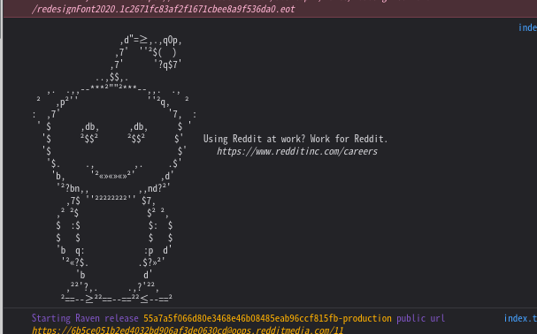

Firefox でマイクとか画面共有とかを使ったときに出てくるこいつを消す[^1]方法。


一応これは安全のために出ているので、専用のプロファイルを作って使用することをおすすめする。
(使用自体おすすめできないのでは？)

1. `about:config` で `toolkit.legacyUserProfileCustomizations.stylesheets` を
    `true` にする (いつの間にか消えてそうな名前だなぁ)。
2. `/.mozilla/firefox/<プロファイル>` の中に `chrome` というディレクトリを作る。
3. その中に `userChrome.css` を作り、以下の内容を書く。

```css
#webrtcIndicator {
    display: none;
}
```

もしくはマウスカーソル合わせたときだけ隠すとか。

ところで Firefox ってときどき Chrome という名前が内部的に使われてる[^2]けど
何なんですかね。

### 参考

- [Is it possible to disable this overlaying microphone icon? : firefox](https://www.reddit.com/r/firefox/comments/6om4zs/is_it_possible_to_disable_this_overlaying/)

---

#### どうでもいいこと

リンク貼るためにタイトルをコピーしようと思って Reddit でブラウザのコンソール開いたら何やら視線を感じた。
ちなみに仕事中 Reddit 見てないです。



[^1]: 画面共有とかするとけっこう邪魔になるので。
[^2]: 新しいタブのページのリソースとか。
