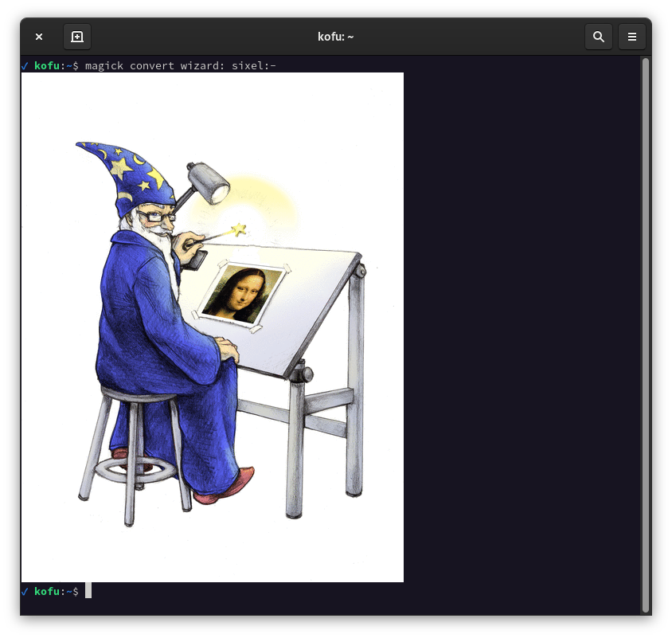

久しぶりに vte のリポジトリを見に行ったら HEAD で Sixel が使えるようになっていたので、
その導入方法を……。

適当に調べた感じだと GNOME 端末 3.37 とかでもサポートされてるっぽいです。
sover 見た感じだと ABI 互換性が崩れたことはなさそうなのでどのバージョンでも問題は起きないかと思います。

## バージョン

Arch Linux 上で確認をしています。
また、実際に使ったコミットのハッシュは以下です。

- `c17e6d12da00a94c3768be6671182a6a039ec0c0`

## 方法

1. まだリリースされていないので HEAD を取ってくる必要があります。
なんかサーバ遅い気がするので `--depth 1` をつけて履歴を取ってこないようにした方がいいかもしれません。

```shell
$ git clone https://gitlab.gnome.org/GNOME/vte.git
```

2. ソースのディレクトリに入り、Meson で Ninja などなどを生成 & ビルドします。
    sixel はデフォルトだと無効なのでここで有効化してやります
    (`-D` は Make とか CMake にあるような、ビルドのオプションを変えるというオプション)。

```shell
$ meson . _build -Dsixel=true && cd _build && ninja
```

3. ビルドに成功したらインストールします。ld.so.conf とかで `/usr/local/lib` を使う設定に
    していれば、そのまま `ninja install` とかでインストールすればいいと思います。
    僕はめんどくさいので乱暴に `_build/src/libvte.so.0.6500.0` を `/usr/lib` にコピーして
    soname のリンク (`/usr/lib/libvte.so.0` などの古いライブラリに張ってある symlink)
    を張り替えるというやり方にしました (おそらくログがローカライズされないくらいで実害はないと思います)。

4. gnome-terminal-server を殺します (どうやらこのサーバから他の端末の窓が生えてるっぽいので)。
    全部の GNOME 端末が閉じるので注意。

```shell
$ killall gnome-terminal-server
```

5. GNOME 端末の「端末について」のウィンドウで VTE バージョンが 0.65.0 になっていることを確認します。
    なっていなければリンク張るところをミスってると思う (多分)。

6. 端末の設定の「プロファイル」の「互換性」のタブから有効化します。

多分この手順でできると思います。ビルドするステップでライブラリが入ってなかったりすると
文句を言われると思いますが、そこは適宜……。

そういえば既に読み込まれているライブラリを上書きすると gnome-terminal-server が死ぬっぽい (？) ので、
3, 4 は screen とか tmux の中からやったほうが無難です。


## 古い GNOME 端末で使いたい場合

多分ここは需要ないと思いますが、この設定が出ないバージョンで使うのはソースをいじらずにはできないと思います。

そういう場合は vtedefines.hh の 146 行目くらいにある `VTE_SIXEL_ENABLED_DEFAULT` を `true` に
変えるとデフォルトで Sixel が有効になるはずです (試してはないけどコード読んだ感じそうだと思う)。

## 追記

egpl0 さんが Ubuntu 21.04 でインストールできるスクリプトを書いてくれたっぽいです。

https://gist.github.com/eggplants/04fa8e4af972098c6db05c0838d99a16
