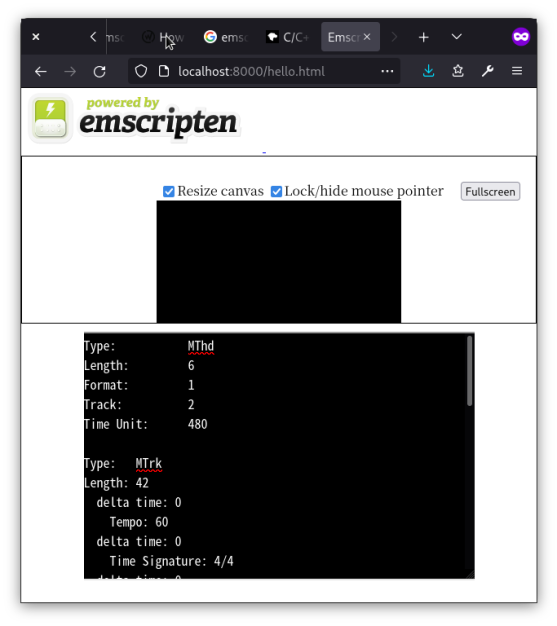

めっちゃお久しぶりです。

WebAssembly でハロワ的なサムシングを C++ でやったらすんなり動きすぎて感動したというポストです。

動機としては C++ で書いた SMF (Standard MIDI File) のパーサをブラウザ上で使いたかった
ということです。別に速度を求めていたとかそういうわけではないのですが、バイナリを扱うのはやっぱり
JavaScript よりも C++ とかの方がぱぱっと書けるかな、という。

で、使ったコードはリンク先に置いてあります。
https://github.com/kofuk/haystack/blob/df5d58caadf1ca640fef80484ac138faa6090c14/smf.cc

一応ビッグエンディアンをリトルエンディアンに変換している部分が wasm での挙動が予想できないため
不安な要素だったんですが、リトルエンディアンと考えていいみたいでした。
(これってコンパイルされた wasm をビッグエンディアンのマシンに持っていったら動かないみたいなことはあるんだろうか)。

## 方法

ファイルの入出力が絡むと面倒くさそうだと思ったので、とりあえずソースコードに埋め込みました。
実際に使うときは埋め込むわけにはいかないので JavaScript から uint8 array みたいな名前の何かで
やり取りしていく感じになるんだろうと思います。

そして、`emscripten` で適当にコンパイルします。このとき、適当にフラグをセットしたりしないといけないらしい。

```shell
$ /usr/lib/emscripten/emcc smf.cc -s WASM=1 -o hello.html
```

するといつの間にか `hello.html`、`hello.js`、`hello.wasm` という 3 つのファイルが生成されています。
これをブラウザから見ると



こんな感じで `main` が実行されています。簡易ターミナルを付けてくれるんですね。

そんなこんなでハロワでたたき台レベルくらいまで行ってしまって呆気にとられているんですが、これから JavaScript
ワールドとデータをやり取りする部分とかも触っていきたいなと思いました。おーしまい。

### 参考

- [C/C++からWebAssemblyにコンパイルする - WebAssembly | MDN](https://developer.mozilla.org/ja/docs/WebAssembly/C_to_wasm)
