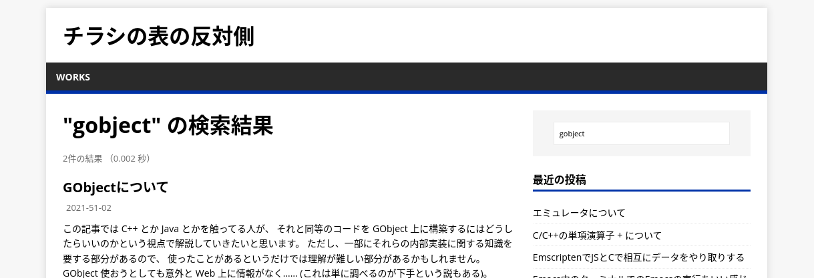
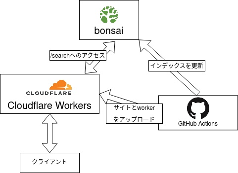

このサイトは静的サイトジェネレータの Hugo を使って生成していて、これまで検索欄は
Google 検索に `site:` をつけてクエリを投げるという方法で実現されていました
(これは[使っているテーマ](https://github.com/Vimux/Mainroad)のデフォルトだったため)。

それを今回、Google に飛ばずに自前で検索を行うという感じにしました。

## モチベーション

Google 検索での一番の問題は、「サイト内のすべてのページにタグ一覧が配置されているために、
キーワードがタグ名と一致する場合すべてのページがヒットしてしまう」という点でした。

Google 検索で検索に使う範囲を指定できればよいのですが、そういったこともできそうになく、
自前で検索する必要性を感じていました。

あと、サイト内の情報が知りたいだけなのに Google にクエリの情報を渡さないといけないという部分も
なんとなく気持ち悪さはあります (まあ今回いろんなマネージドなサービスを使っているので
そこの気持ち悪さはさほど変わらないですが)。

あとはサイト内で完結するとなんとなく嬉しいみたいな気分の面もあります (え？)

## 構成



Cloudflare Workers と bonsai の Managed Elasticsearch を使っています。

サイト内検索の導入にあたり、サイト全体を Cloudflare の Workers Sites に引っ越しました
(これまでは Cloudflare Pages を利用していました)。
Cloudflare の Rules を使えば一部の path のみを Cloudflare Workers に処理させることも可能ですが、
無駄に分散させることもないので統一しました。

Cloudflare Workers はざっくり言うとエッジで動く ServiceWorker という感じで、ServiceWorker よろしく
FetchEvent を受け取って何かしらレスポンスを返すというコードを書くと、それがブラウザ内ではなく
www でワーカーとして動くみたいなサービスです (多分←予防線)。

で、この Cloudflare Workers は独自の key-value ストアを持っていて、そこに static なコンテンツを
置いておくことで worker とサイトを両立させるというものっぽいです。
まあテンプレートに従ってやっていればあんまり後ろの key-value ストアを意識することはないので正直ここの理解は浅いです。

全文検索には bonsai の Elasticsearch を使っています。Kuromoji Plugin もデフォルトで入っていて、
制限も個人のブログに使うくらいだったら引っかかることはなさそうです。便利です。
Elasticsearch に入れるデータは bonsai が用意してくれていた資料を参考に Hugo で ndjson を吐き出すようにし、
Bulk API を叩いています。

でこれらのサービスへのデプロイは GitHub Actions でやっています。

## bonsai について

お馴染み…なのかは知らないけど無料で Elasticsearch が使えるサービスです。詳しい制限は公式参照。

無料プランだと権限を削ったアカウントを作ることができないので、最強のアカウントをいろんなところに保存しないといけないので
若干気持ち悪さはあります。まあ割とどうでもいい情報ばかりなんでどうでもいいですけど。

## Cloudflare Workers について

こちらも無料枠でやっています。Workers は 1 日あたり 100000 回、 KV は書き込み 1000 回、読み取り 10 万回までの制限がありますが、
今のところ気にしなくても大丈夫そうです。

エッジで動く ServiceWorker です。JavaScript か WebAssembly がデプロイできます。
ServiceWorker というだけあって Node.js の API が使えないので、[@elastic/elasticsearch](https://www.npmjs.com/package/@elastic/elasticsearch)
が使えないっていうんでちょっとウンウン唸ってたんですが、普通に Elasticsearch の REST API 叩けばいいことに気づいたので
そういう方法でやっています。

### デプロイ

デフォルトで `*.*.workers.dev` にデプロイされるので、カスタムドメインを使おうとしなければめちゃくちゃ簡単です。

カスタムドメインを使う場合 (Cloudflare で管理している必要があるようですが) `wrangler.toml` に `route` と `zone_id`
を書いておけばその HTTP ルートを自動で作ってくれます。

これで若干ハマったのが、デプロイするドメインの DNS の設定で A か AAAA もしくは CNAME が設定されていないと
アクセスができないという点です。

> You need to have a DNS record for the routes you add in the Workers tab, they won’t be automatically added. Two options until they fix it more systematically, which they are doing:
>
> - A single A record pointing to a random IP. I recommend 192.0.2.1 which is a test network not used by anyone. A local IP could work as well, but not really recommended.
> - A CNAME to a random subdomain on your domain, which doesn’t need to exist.
>
> Make sure that this subdomains need to be :orange: for Workers to run.

https://community.cloudflare.com/t/setup-workers-on-personal-domain/88012/5

どうやら Worker を経由させるためには何らか Cloudflare がプロキシするサーバがあるようなレコードを置かないといけない
という問題があるらしく、適当に例示用アドレスを入れたレコードを作っておきました。
実際のリクエストは Worker が全部捌いてしまうのでこの IP アドレスが実際に使われることはないです。

### ローカル開発環境

ローカル環境で Cloudflare Workers をシミュレートする miniflare というのがあります。Workers Sites の場合、
static なファイルが `./public` にあるとすると

```console
$ npx miniflare --site ./public
```

みたいにすればいいみたいです。Worker の変数 (vars) は `.env` ファイルに書いておけば、それを使ってくれました。

## 問題点

適当に Elasticsearch に insert ばかりが行われているので消した記事がリークしてたり古い内容をもとに
検索が行われてしまったりしてそう。いつか直す

#### 参考資料

- [Cloudflare Workers®](https://workers.cloudflare.com/)
- [Bonsai | Fully Managed Elasticsearch & OpenSearch](https://bonsai.io/)
- [Hugo - bonsai](https://docs.bonsai.io/article/105-hugo)
