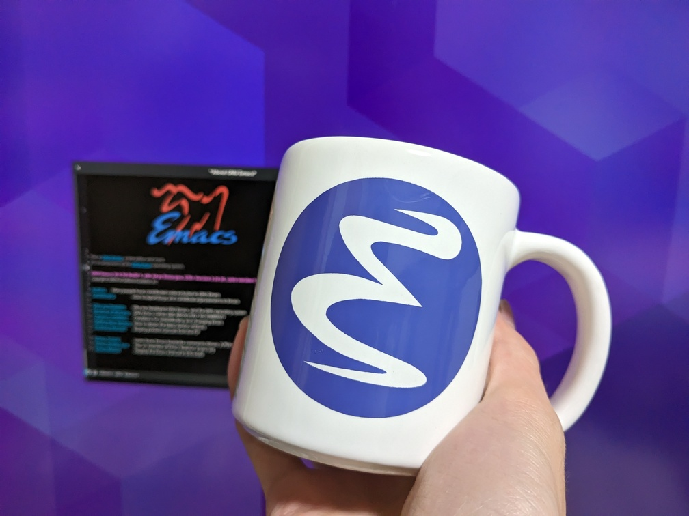

[FSF のショップにある Emacs のマグカップ](https://shop.fsf.org/gear/emacs-auto-fill-mode-mug)を買ってみました。

テカテカで映り込みそうなのであんまり写真は上げていないんですが、なかなか良いです。
ロゴの色は FSF のページの写真よりちょっと青っぽいですね。これは個体差なんでしょうか。

これを注文したのは 11/29 とかだったのですが、届いたのは年が明けて 1/25 とかでした。
箱に何故か中国郵政のステッカーが貼ってあったので、誤配送で中国を経由してしまった説はあります。
（一番安い配送オプションを選んだせいもあると思います。）  
1 ヶ月後に控えた引っ越しに間に合うかとビクビクしていたんですが、何もメールが来なかったのは FSF に登録しているメールアドレスを
更新し忘れていたせいだと後で気づきました。

質感ですが、ceramic と言ってるので陶器っぽい感じかと思っていたら打音は磁器っぽいです。
爪で弾くとレ〜ミの音がします（どうでもいい）。
細かいことをいうと縁の釉薬か薄いという若干の粗はありますが、まあ文句を言うほどのものでもないと思います。

こういうグッズを買うのも OSS の支援になると思うので、気に入ったやつがあったらまたポチってもいいなと思っています。
