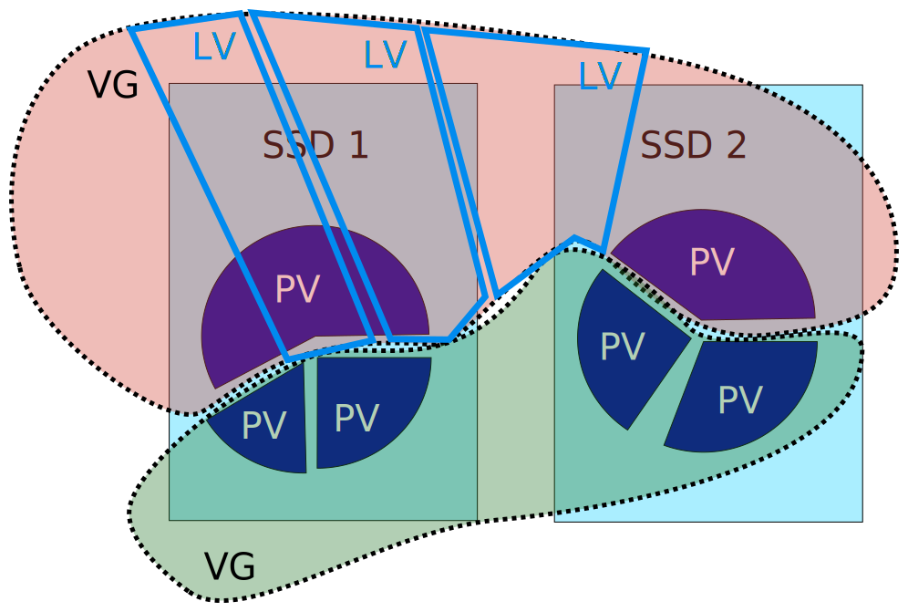

LVMというのは抽象化したレイヤーを通して物理的なストレージにアクセスするというやつ（適当）。
物理的なストレージを直接使うよりもいろいろ変なことができるので嬉しいらしい。

## 雑に概念を説明

LVM には PV（Physical Volume）、VG（Volume Group）、LV（Logical Volume） という概念がある。

まず、PV というのは物理的なストレージに一対一で対応する概念で、SATA 接続のストレージだと `/dev/sda1` で一個、 `/dev/sda2` で一個みたいになる。
SSD をパーティションで区切っていない場合は `/dev/sda` で一個の PV とか。

次に、VG というのは、普通にストレージを使っているときは 1 個のストレージデバイスに対応する概念（のような気がする）で、
1 個以上の PV をまとめて 1 個のボリュームにできるというもの。
普通のストレージと違うのは、複数のデバイスとかパーティションにまたがっていてもいいという点。

最後に LV というのは、パーティションに対応する概念で、VG を切って作る。
割と自由にリサイズできたり、シンプロビジョニングとかもできるらしい。

で、LV の上にファイルシステム（ext4 とか）を作って使う。



ただまあ、いろんなところから寄せ集めた PV で VG を作ると壊れたときの対処がめんどくさいみたいなことを言ってる人もいて、
VG ではあんまり凝ったことをせずに LV の機能の恩恵だけ受けるという使い方が一番楽なのかもしれない
（個人の趣味でやるくらいだとそこまで大きな VG が必要になることはあまりなさそう）。

## 使ってみる

PV を作る

```shell
$ sudo pvcreate /dev/sda1 /dev/sda2
```

パーティションを切らずに使う場合、ボリュームラベルがあると `device is partitioned` みたいなことを言われて
PV を作ることができない。その場合は `wipefs` コマンドで消す（これが正しいのかは知らん）。

```shell
$ sudo wipefs --all /dev/sda
```

VG を作る。

```shell
$ sudo vgcreate myvg /dev/sda1 /dev/sda2
```

これで `/dev/sda1` と `/dev/sda2` の合計サイズの VG ができる。

LV を作る。

```shell
$ sudo lvcreate -L 1GiB myvg -n mylv
```

これで 1 GiB の mylv という LV ができる。空き容量に対する割合でサイズを指定したい場合は `-l 100%FREE` みたいに指定する  
`-n` は指定しなくてもいいが、その場合は適当な名前がつく。

これで `/dev/mapper/myvg-mylv` に作った LV が見えるので、普通のディスクみたいに使えばいい。

例えば ext4 ファイルシステムを作る場合はこういう。

```shell
$ sudo mkfs.ext4 /dev/mapper/myvg-mylv
```

## USB メモリとかに作るとどうなる？

抜く前に VG を無効化すればいい

```shell
$ sudo vgchange -an myvg-mylv
```

挿入したときは自動的に有効化してくれる。無効化した VG を手動で有効化するには

```shell
$ sudo vgchange -ay myvg-mylv
```

yes/no なのちょっと面白いよね。

あと別のマシンに持っていっても何事もなかったかのように VG が `/dev/mapper` の中に見えるようになる。

ちなみに VG 名が衝突した場合、被ってる VG のうちどちらかをリネーム[^1]しないことには何もできないっぽいのでリムーバブルメディアで使うのは多分推奨されない。

## 起動時にマウント

普通にやることだと思うけど fstab に書けばいいだけ。

```plaintext fstab
/dev/mapper/myvg-mylv	/mnt	ext4	defaults	0	0
```

勝手にパーティションの UUID を覚えてくれているのでいいですね

## PV がぶっ壊れたとき

適当にぶっ壊してみたところ、LVM の管理領域を壊してしまったのでその PV は認識されなくなってしまった。
一応一部の PV しかなくてもマウントは可能

```shell
$ sudo vgchange -ay --activationmode partial myvg
```

認識されていない領域を触ると I/O エラーになるけど読めるところは読める。

多分うまくデータのところだけを壊したときの挙動は普通にファイルシステムを壊したときの挙動と同じはず。

## スナップショット

CoW らしいがあんまり試してないので本当に CoW なのかは分かってない。
残りの容量がわずかでもスナップショットは取れるのでまあそうなんだろうなーという感じはするけど。

```shell
$ sudo lvcreate -s -l 100%ORIGIN myvg/mylv -n ss
```

これで何やら怪しげなデバイスが生えてくる。

```shell
$ ls /dev/mapper 
/dev/mapper/control    /dev/mapper/myvg-mylv-real  /dev/mapper/myvg-ss-cow
/dev/mapper/myvg-mylv  /dev/mapper/myvg-ss
```

`-cow` とか `-real` とかがついてるやつはマウントできなかった。なぜ存在するのかは不明。

で、スナップショットに戻す。この操作自体はマウントしていてもできるが、マウント中に戻した場合は一旦 LV を無効化しないと反映されないので注意。

```shell
$ sudo lvconvert --merge myvg/ss
```

マージという表現に惑わされそうになるが、スナップショットのボリュームに完全に置き換わる。
元のボリュームにスナップショットのファイルを移動させていく、という感じではない（つまりスナップショットに戻る）。
まあ LVM は上に乗っているファイルシステムに関与しないのでそれはそうといえばそれはそうだが。  
ついでに、スナップショットのボリュームとか `-cow` とか `-real` とかも完全に消えている。

ちなみにスナップショットも普通のボリュームみたいに見えるけど、スナップショットのスナップショットは取れない。

[^1]: [ボリューム名が重複したディスクのLVMボリュームをマウントする - Thought about system by Hiroyasu Ishikawa](https://hiroi.hateblo.jp/entry/2019/01/15/001047)
