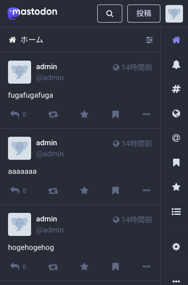
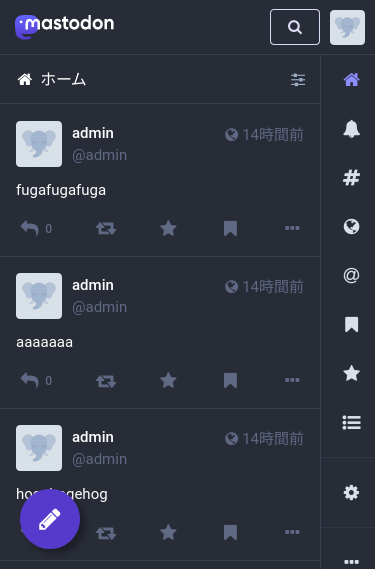


この記事は「[Cybozu Frontend Advent Calendar 2023](https://adventar.org/calendars/9255)」
13 日目の記事です。


一家に一台 Mastodon とはよく言ったもので[^1kani]、今や Mastodon のサーバは人々の生活に必要不可欠なものになっています。（そんなことはない）  
そして、自分で Mastodon のサーバを立てると、Mastodon 自体を改造する必要に迫られたり、細かい不便を解消するために手を入れたくなったりしてくるものです[^css-only]。
この記事では、私が Mastodon のフロントエンドに手を入れた際の知見を共有します。

ちなみに業務ではフロントエンドとはかなり遠い領域を触っていて、フロントエンドは何も分かりません。

## Mastodon とは？


（↑分かりやすい*らしい*動画。kofuk は真面目に見たことがないですが）

Mastodon はオープンソースの分散型 SNS です。


Mastodon は Twitter（とかいう存在しない SNS）[^twitter] に似ていて、短文を投稿したり、投稿にいいねしたり、リポスト（Mastodon ではブーストと呼んでいる）したりできます。
逆に、既存 SNS と一線を画しているのが、[ActivityPub](https://www.w3.org/TR/activitypub/) という標準化されたプロトコルを使用して、他の人が立てたサーバと情報をやりとりできるという点です。
これによって、別のサーバにいるユーザのフォローや、そのユーザの投稿に対してのリアクションが可能になっており、これが Mastodon を「分散型」たらしめています。

なお、前述した ActivityPub をサポートする SNS は Mastodon の他にもいくつもあり、最近では [Misskey](https://github.com/misskey-dev/misskey) に勢いがあります。
また、このプロトコルを実装した SNS を自作するというのも一部で流行っていたり流行っていなかったりするようです。[^waq] [^bozudon]


もし興味を持った方がいれば、ぜひアカウントを作って触ってみてください。誰でもアカウントを登録できる Mastodon サーバがたくさんあります。  
国内では [mstdn.jp](https://mstdn.jp/)、[Pawoo](https://pawoo.net/)、[Fedibird](https://fedibird.com/)、[Mastodon Japan Server](https://mastodon-japan.net/) あたりが有名です。


## Mastodon の技術スタック

Mastodon のバックエンドは主に Rails で書かれています。
バックエンドには全文検索とかストリーミング API とかがいるのですが、今回はフロントエンドの話ということで省略します。

フロントエンドは、React 製の SPA と Rails で HTML をレンダリングして返している部分が混在しています。
React のページは axios で Mastodon の REST API を叩くようになっていて、ルーティングには React Router、状態管理には Redux が使用されています。
Rails でレンダリングしているページは [HALM](https://haml.info/) でマークアップされていて、初見だと読めないです（？）  
おおまかに、タイムラインや投稿といった画面は React、それ以外は Rails で返しているようです。

## Mastodon を改造してみよう！

### 改造した Mastodon をどうやって運用しているか

私は実際に Mastodon のサーバを立てていますが、そこで使用しているのは少しソースコードを改変した Mastodon です。
ここで問題になるのが upstream で新しいバージョンが出た際にはそれに追随していかなければいけないという点です。
改変した部分を保ちつつ、upstream に追随するにはどうしているのか、イメージがつかない方もいるかもしれないのでここで少し説明します。
（あくまで kofuk がこういう運用をしているという話で、他の人々は違うやり方をしているかもしれません。）

多くのソフトウェアがそうであるように、Mastodon は新しいバージョンが出るとそのバージョンでタグが打たれます。
例えば投稿時点で最新の 4.2.3 であれば、[このように](https://github.com/mastodon/mastodon/releases/tag/v4.2.3)タグが打たれています。
デプロイ用には、このタグがついたコミットをベースにブランチを切り、変更を加えていきます。（[今使っているのはこれ](https://github.com/kofuk/mastodon/tree/custom-4.2)）

新しいバージョンが出たら、そのバージョンのタグに rebase（例えば 4.2.4 が出たら `git rebase v4.2.4`）していくことで、新しい変更を取り込んでいます。
コンフリクトが起きたらここで頑張って解消します。

周辺のコードが変わって不整合が起きているかもしれないので、一度本番とは別のマシンで起動して動作確認し（動作確認せずに雰囲気で上げることもある）本番のサーバを更新しています。

### 環境構築

軽いカスタマイズなら [production 用に構築](https://docs.joinmastodon.org/admin/install/)したサーバで行っても良いのですが、
ちゃんと開発しようとするとかなり厳しい気持ちになるので、開発環境を立ち上げてみます。
Ubuntu 23.10 のマシンで動作確認しました。

Mastodon の開発環境をローカルで構築する方法はいくつかあります。

- Vagrant で環境を立てる
- ローカルのマシンに直接インストール
    - 公式ドキュメントにはこの方法がオススメっぽい雰囲気が漂っています
- Docker で環境を立てる
    - 公式には多分用意されていない。[anqou](https://twitter.com/ushitora_anqou) が [Mastodon の開発用 Dockerfile を作っていた](https://github.com/ushitora-anqou/waq/blob/master/docker_dev/Dockerfile.mastodon)のでこれをベースにやればいけそうです（やってないけど）

この記事では Vagrant でサクッと（といいつつ、配布されている Vagrantfile が動かなかったので微妙に苦労した）開発環境を立てていきます。
[公式のドキュメント](https://docs.joinmastodon.org/dev/setup/#vagrant)を参考にやっていきましょう。
Vagrant と VirtualBox が入っていることを前提に進めます。
（ドキュメントでは触れられていない気がするのですが、Mastodon の Vagrantfile は VirtualBox を前提としているので、VirtualBox も必要になります。）

とりあえず Mastodon のコードがないと始まらないので、取ってきます。

```shell
$ git clone https://github.com/mastodon/mastodon.git -b v4.2.3
```

clone したリポジトリの中身を見ると、`Vagrantfile` があります。これを使って Mastodon をローカルで立ち上げたいのですが、
私の環境では微妙に動かない箇所がありました。
この部分を適当に動くようにしたものが[こちら](https://github.com/kofuk/mastodon/blob/custom-4.2/Vagrantfile)にあるので、これで置き換えてください。
（Ubuntu 23.10 以外では動作確認していないので、違う環境だと動かない可能性もあります）

hosts の設定を自動でやってくれる、vagrant-hostupdater を入れます。（これは任意ですが、自分は使いました）

```shell
$ vagrant plugin install vagrant-hostsupdater
```

ここまでできたら、VM を立ち上げましょう。VM で環境構築が走るので少し時間がかかります。

```shell
$ vagrant up
```

無事成功したら、あとは VM の中で Mastodon のプロセスを立ち上げます。

```shell
$ vagrant ssh -c "cd /vagrant && foreman start"
```

これを実行してしばらくすると、ブラウザで `http://mastodon.local` にアクセスすることで Mastodon のトップページが開けるはずです。
メールアドレスが `admin@mastodon.local`、パスワードが `mastodonadmin` のアカウントが自動で作成されています。

VM の中のプロセスがファイルをウォッチしてくれているので、コードをいじれば自動的にリビルドが走ります。

### フロントエンドのコードをいじってみる

環境ができたので、React の部分を触っていこうと思います。ここまで来ればあとはやるだけです（？）[^toomuch]

今回は Twitter にあるような、投稿ボタンを足してみることにします。


まず、もともとの Mastodon の画面がどうなっているか見てみましょう。



右上に「投稿」ボタンが配置されているのが分かると思います。左手でスマホを持つ派なので、この位置のボタンは指が届かず若干使いづらいです。

このボタンが既存のコードでどのように実現されているのか、見てみます。
このボタンを表示する部分は `app/javascript/mastodon/features/ui/components/header.jsx` にあります。

```jsx
//...
  render () {
//...
    let content;

    if (signedIn) {
      content = (
        <>
          {location.pathname !== '/search' && <Link to='/search' className='button button-secondary' aria-label={intl.formatMessage(messages.search)}><Icon id='search' /></Link>}
          {location.pathname !== '/publish' && <Link to='/publish' className='button button-secondary'><FormattedMessage id='compose_form.publish_form' defaultMessage='New post' /></Link>}
          <Account />
        </>
      );
    } else {
// ...
    }

    return (
      <div className='ui__header'>
        <Link to='/' className='ui__header__logo'>
          <WordmarkLogo />
          <SymbolLogo />
        </Link>

        <div className='ui__header__links'>
          {content}
        </div>
      </div>
    );
  }
//...
```

React Router の `Link` コンポーネントを使って、`/publish` へのリンクをレンダリングしているだけのようです。
同じようにリンクを配置して丸いボタンっぽいスタイルを設定すれば良さそうなので、追加していきます。

画面全体のコンテナになっている `UI` コンポーネント（`app/javascript/mastodon/features/ui/index.jsx`）に link を追加します。

```jsx
    const composeButton = (
      <Link to='/publish' className="ui__composebutton">
        <Icon id='pencil' fixedWidth />
      </Link>
    );
```

`Link` の中に `Icon` コンポーネントを配置しました。これは Mastodon が内部で使用している、Font Awesome のアイコンをレンダリングするためのコンポーネントです。

あとは雰囲気で CSS を書けば

```scss
.ui__composebutton {
  display: block;
  position: fixed;
  left: 0;
  bottom: 0;
  width: 60px;
  height: 60px;
  margin: 20px;
  border-radius: 999px !important;
  font-size: 25px;
  line-height: 60px;
  text-align: center;
  background-color: $blurple-600;
  color: $primary-text-color;
  box-shadow: 5px 5px 5px rgba(0, 0, 0, 0.3);
}
```

それっぽいボタンが追加されました！
Twitter の投稿ボタンは右下にありますが、今回は UI 部品を左に寄せたかったので左下にボタンを持っていってみました。
これで、右上のボタンではなく、このボタンを使用して投稿画面に移動できます。



## 終わりに

さてさて、Mastodon の開発環境構築をして、フロントエンドにちょっとした修正を入れてみました。
既存のソフトウェアを改造して遊ぶのは、ゼロから開発するのとはまた違った楽しみがあります。
Mastodon のサーバを立てていると、自分が改造した画面を使って投稿ができるだけでなく、人の投稿もそこに流れてくるのでちょっと不思議な感じがします。
また、良いものができたらアップストリームに還元できればさらに良さそうです。

Mastodon に限らず、OSS を雑に改造するのは楽しいので、やったことがある人もない人も是非やってみてください！

[^1kani]: たぶん誰も言ってない
[^css-only]: CSS のみ変更すれば良い場合は、カスタム CSS の機能を使って、ソースコードを改変することなくスタイルを変更することができます
[^twitter]: 最近ある大富豪に買われて、X とかいう名前で呼ばれているらしいです
[^waq]: [Waq](https://github.com/ushitora-anqou/waq): OCaml で書かれた ActivityPub サーバ
[^bozudon]: [Bozudon](https://github.com/bozudon/bozudon): Rust 製の Mastodon クローン。[サイボウズの新人研修で開発](https://blog.cybozu.io/entry/2023/09/15/080000)したもので、ActivityPub をサポートしている
[^toomuch]: やりすぎると upstream で新しいバージョンが出たときの追随大変になるので注意が必要です
