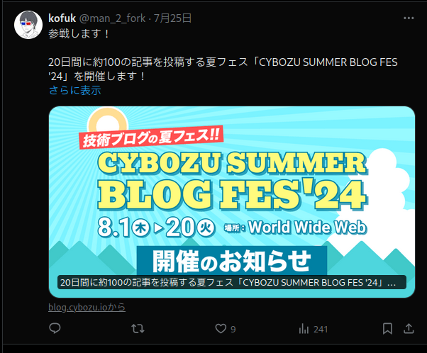
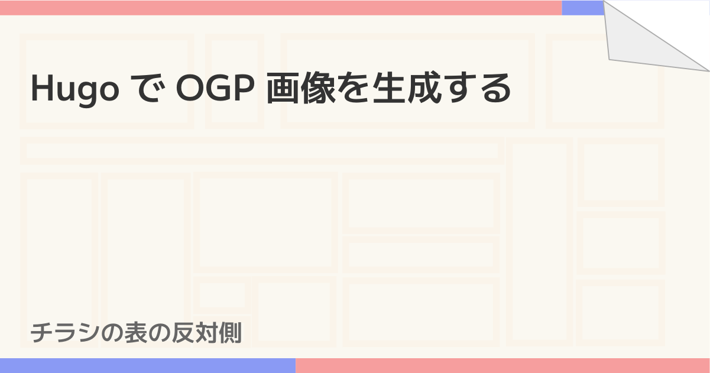

全国の Hugo ファンの皆さん、こんにちは（？）  
アドベントカレンダー以外でブログを書かない人になりつつあるので、
静的サイトジェネレータ (SSG) である Hugo を使って OGP 画像を自動生成した話でもしたいと思います[^1]。

Hugo は Go 言語で書かれた SSG で、Go の template を使ってサイトのレイアウトを組んでいくことになります
（テーマと呼ばれる、出来合いのレイアウトを使うこともでき、これも結局は Go の template で書かれています）。
テンプレートは記事の一覧や記事自体のページを作っていく、というのが基本の使い方になるのですが、
Hugo にはテンプレートの中で Sass や TypeScript のトランスパイルを行ったり、画像を生成したりする機能がついています[^2]。
この機能を使って、OGP 画像を生成してみた、というのが今回やったことです。

## OGP 画像とは？

こういうやつです。



（宣伝というわけではありませんが、CYBOZU BLOG FES '24 の最終日 8/20 に記事を出す予定です[^3]。）

OGP 画像と呼ぶのが正しいのかは謎ですが、雑に検索するとこう呼んでいる人が一定数いそうなので適当にそう呼んでいます。  
Zenn とか Qiita みたいなサイトでも記事のタイトルがでかでかと書かれた画像をよく見かけますね。

## 最終的にできたもの

こういう partial を作りました。（`layouts/partials` に置きます。）

```go-html-template
{{/* もし ogp.png というファイルがあれば、それを使う */}}
{{- $image := .Resources.Get "ogp.png" }}
{{- if not $image -}}
  {{/* ogp.png がないので、生成する */}}

  {{/* 文字のレンダリングに使うフォントをダウンロードする */}}
  {{- $font := resources.GetRemote "https://github.com/coz-m/MPLUS_FONTS/raw/master/fonts/ttf/Mplus2-SemiBold.ttf" }}

  {{- if .IsPage -}}
    {{/* 記事ページの場合。記事タイトルの画像を生成する */}}

    {{/* タイトルの 18 文字ごとに改行を入れる */}}
    {{- $maxLen := 18 }}
    {{- $len := strings.RuneCount .Title -}}
    {{- $titleText := "" -}}
    {{- range $i := seq 0 (div $len $maxLen) }}
      {{- $line := substr $.Title (mul $i $maxLen) $maxLen }}
      {{- $titleText = printf "%s%s\n" $titleText $line }}
    {{- end -}}

    {{/* 記事とサイトのタイトルをベースの画像の上にレンダリングする */}}
    {{- $articleTitle := images.Text $titleText (dict "font" $font "color" "#333" "size" 60 "x" 50 "y" 100) }}
    {{- $siteTitle := images.Text site.Title (dict "font" $font "color" "#666" "size" 40 "x" 50 "y" 530) }}
    {{- $image = (resources.Get "img/ogp.png" | images.Filter $articleTitle $siteTitle) }}
  {{- else }}
    {{/* 記事以外のページの場合。サイトのタイトルの画像を生成する */}}
    {{- $title := images.Text site.Title (dict "font" $font "color" "#333" "size" 100 "x" 140 "y" 220) }}
    {{- $image = (resources.Get "img/ogp.png" | images.Filter $title) }}
  {{- end -}}
{{- end -}}
<meta property="og:image" content="{{ $image.Permalink }}" />
```

これを `_baseof.html` とかで読み込むと、OGP 画像が表示されるようになります。

Twitter[^4] で大きく表示してアピールしたい場合はこれを入れるとよいです。

```html
<meta name="twitter:card" content="summary_large_image"/>
```

## 詳しめの説明

Hugo の画像処理機能にテキストのレンダリングがあるので、これを使って書いていくだけです。
ただ、Hugo には文字列を適切な幅で折り返す機能がないので、これを雑実装しています。

```go-html-template
    {{- $maxLen := 18 }}
    {{- $len := strings.RuneCount .Title -}}
    {{- $titleText := "" -}}
    {{- range $i := seq 0 (div $len $maxLen) }}
      {{- $line := substr $.Title (mul $i $maxLen) $maxLen }}
      {{- $titleText = printf "%s%s\n" $titleText $line }}
    {{- end -}}
```

18 文字ごとに `substr` で切り出して、`$titleText` にくっつける、ということを繰り返しています。
Go のテンプレートには文字列結合の機能がないらしく、Hugo の `printf` とかいう実質 `sprintf` な関数でくっつけています。  
実装を見ると分かると思うのですが、禁則処理とかはもちろん実装していないので、単語の途中とかでも容赦なく改行を入れてきます。
……が、これはまあ諦めています。実装できるのか知りませんが、できたとしてもめっちゃ遅いと思いますし。

そのあと、生成した文字列を画像化したりサイトタイトルを画像化したりして、ベースのイメージの上に重ねています。

```go-html-template
    {{- $articleTitle := images.Text $titleText (dict "font" $font "color" "#333" "size" 60 "x" 50 "y" 100) }}
    {{- $siteTitle := images.Text site.Title (dict "font" $font "color" "#666" "size" 40 "x" 50 "y" 530) }}
    {{- $image = (resources.Get "img/ogp.png" | images.Filter $articleTitle $siteTitle) }}
```

`img/ogp.png` というのがベースのイメージで、リポジトリの `assets/img/ogp.png` に置いています（[GitHub だとここ](https://github.com/kofuk/www.kofuk.org/blob/d69d71a18506da3f8d6548cf2ab86a94789e2102/assets/img/ogp.png)）。

これで、最終的にはこういう画像が生成できます。これが Go のテンプレートで実装されているとはね（語弊がある）。



画像の数はページの数とほぼ同じなので、今のところ（無駄なファイルが出力されることもなく）いい感じで動いていそうな気がします。

おわりです。

[^1]: 実は半年以上前にやったことなのですが、なかなかブログを書く気にならなかったので今書いています。
[^2]: テンプレートの中で使える関数はここにまとまっているので、眺めてみると意外な発見があります。 https://gohugo.io/functions/
[^3]: 詳細は [CYBOZU SUMMER BLOG FES '24 特設サイト](https://cybozu.github.io/summer-blog-fes-2024/) を見てください。
[^4]: X と呼ぶ人もいるみたいなのですが、なぜなのかわかりません。
