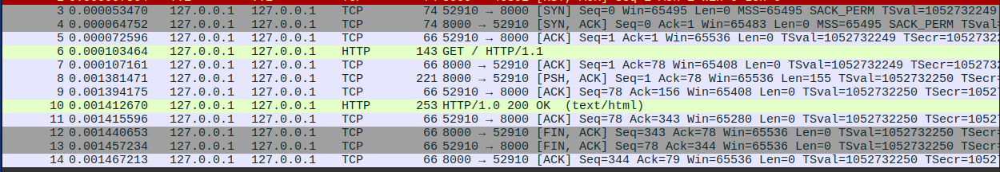
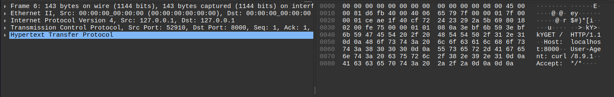
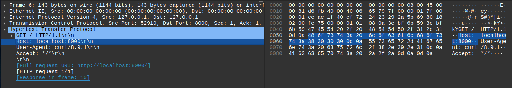
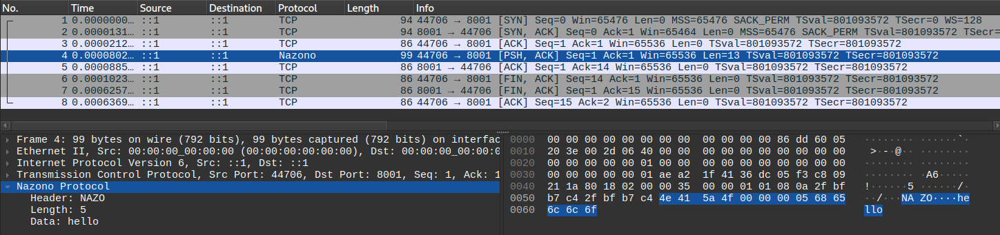
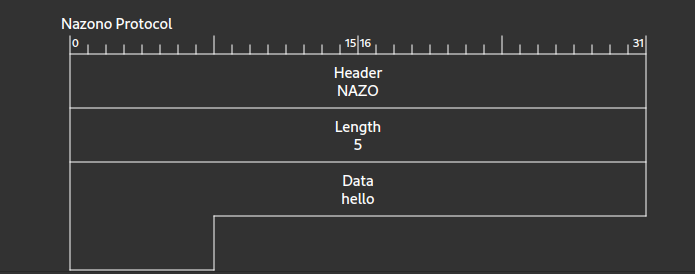
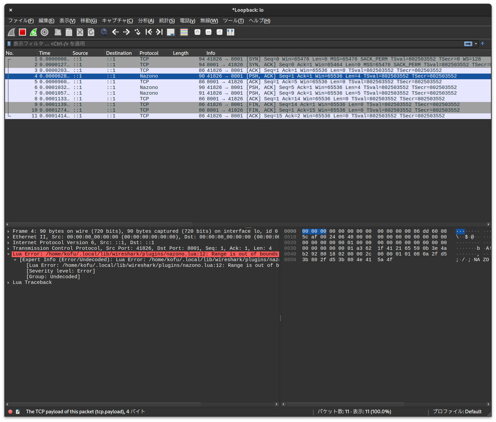
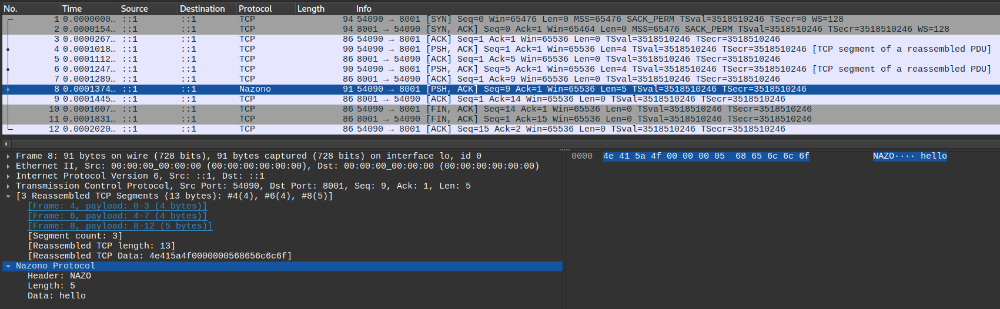
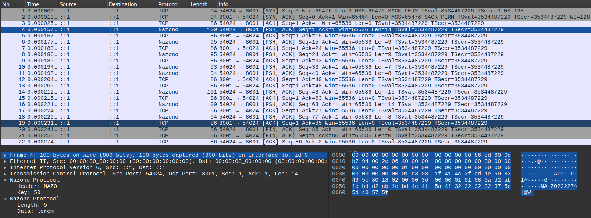


この記事は、[CYBOZU SUMMER BLOG FES '24](https://cybozu.github.io/summer-blog-fes-2024/) (Garoon Stage) DAY 20 の記事です。


こんにちは！　サイボウズ Garoon 開発チームの kofuk です。

CYBOZU SUMMER BLOG FES '24 も今日で最終日ですが、今日の話はまるっきり業務とは関係がありません。つまり夏の自由研究です。
普段はプロトコルの解析とは縁遠い生活を送っているのですが、たまにはバイト列と触れ合いたくなるのが人の性というものです。  
いつもは意識することのないレイヤーに潜ってみることにしましょう！

## Wireshark とは？

Wireshark に馴染みのない人もいるかもしれないので、まず Wireshark 自体について説明します。
Wireshark はざっくり言うとネットワークを流れているデータをキャプチャして解析するソフトウェアです[^wireshark]。  
これを使うことで、例えばブラウザで Web サイトにアクセスした際に（Wi-Fi アダプタを介して）やり取りされているデータを GUI で見ることができます。

試しにローカルで立てた HTTP サーバにアクセスするときのパケットをキャプチャしてみましょう。
（ローカルのサーバとの通信はループバックインタフェースという仮想的なネットワークインタフェースでやり取りされるので、Wi-Fi で通信する場合と若干異なります。）



このように、送受信されたパケットの情報を時系列で見ることができます。
最初の 3 行（3--6）に `[SYN]`, `[SYN, ACK]`, `[ACK]` と表示されたパケットがあることから分かるように、TCP の 3 ウェイ・ハンドシェイクが行われていますね。

馴染みのある `HTTP` として表示されている行が見えます。6 の行を開いてみましょう。`GET / HTTP/1.1` と表示されていることから、HTTP リクエストのように見えます。



左側にパケットの詳細が表示されており、右側には 16 進ダンプが表示されています。
パケットの詳細はさらに展開することができ、例えば HTTP の表示はこのようになります:



HTTP ではメリットが分かりにくいですが、項目ごとに値がデコードされて表示されます。
ここでは `Host`, `User-Agent` といったヘッダの値（ある場合は body のデータ）が表示されています。
デコードされたデータか、右の 16 進ダンプを選択すると、もう一方の対応する部分がハイライトされます。

このように、Wireshark を使えば GUI で通信内容を簡単に[^easy]キャプチャして解析できることがおわかりいただけたと思います[^tshark]。

## オレオレプロトコルに対応させてみよう！

前章で述べたように、一般的なプロトコルであれば Wireshark 自体が対応しているため、データの解析は簡単です。
しかし、自分で定義したプロトコルの場合はそうはいきません。Wireshark はそのプロトコルを理解していないため、わかりやすい形で表示してくれません。
自分でプロトコルを解析できるようにしてみましょう。

パケットをデコードして表示するモジュールは dissector と呼ばれています。
これを実装することにより、Wireshark に新たなプロトコルのサポートを追加することができます[^extcap]。
Dissector の実装には Lua か C の API を使用することができます[^lua-vs-c]。  
ここでは Lua の API を利用して簡単な dissector を実装してみます。

### Lua でシンプルな dissector を実装する

以下のようなプロトコルを考えてみます。

- TCP の 8001 番ポートを使用する
- 最初にヘッダとして固定の文字列 `NAZO` を送る
- 次に 32 ビット符号なし整数（ビッグエンディアン）でデータの長さを送る
- データの長さぶんのデータを送る

Go 言語でクライアントを書くとこんな感じになります。（エラー処理は適当です）

```go
func main() {
	conn, err := net.Dial("tcp", "localhost:8001")
	if err != nil {
		log.Fatal(err)
	}
	defer conn.Close()

	writer := bufio.NewWriter(conn)
	defer writer.Flush()

	// ヘッダー
	writer.Write([]byte("NAZO"))

	// データの長さ
	buf := make([]byte, 4)
	binary.BigEndian.PutUint32(buf, 5)
	writer.Write(buf)

	// データ
	writer.Write([]byte("hello"))
}
```

これの dissector はこのように書くことができます。

```lua
-- 新しいプロトコルを定義
local nazono = Proto("nazono", "Nazono Protocol")

-- プロトコルのフィールドを定義
f_header = ProtoField.new("Header", "nazono.header", ftypes.STRING)
f_length = ProtoField.new("Length", "nazono.length", ftypes.UINT32)
f_data = ProtoField.new("Data", "nazono.data", ftypes.STRING)

nazono.fields = { f_header, f_length, f_data }

function nazono.dissector(buffer, pinfo, tree)
    pinfo.columns.protocol = "Nazono"

	if buffer:raw(0, 4) ~= "NAZO" then
        -- このプロトコルではない
		return 0
	end

    -- データをデコードして Wireshark の tree に登録していく
    local length = buffer(4, 4):uint()
    local subtree = tree:add(nazono, buffer())
    subtree:add(f_header, buffer(0, 4), buffer:raw(0, 4))
    subtree:add(f_length, buffer(4, 4), length)
    subtree:add(f_data, buffer(8, length), buffer:raw(8, length))
end

-- TCP の 8001 番の dissector として登録
tcp_table = DissectorTable.get("tcp.port")
tcp_table:add(8001, nazono)
```

`nazono.dissector` の部分が dissector の本体です。  
引数の `buffer` は [`Tvb`](https://www.wireshark.org/docs/wsdg_html_chunked/lua_module_Tvb.html#lua_class_Tvb)、`pinfo` は [`Pinfo`](https://www.wireshark.org/docs/wsdg_html_chunked/lua_module_Pinfo.html#lua_class_Pinfo)、`tree` は [`TreeItem`](https://www.wireshark.org/docs/wsdg_html_chunked/lua_module_Tree.html#lua_class_TreeItem) のオブジェクトが渡されるようです。

最初の `pinfo.columns.protocol` はパケットの一覧の Protocol フィールドに対応していて、ここに適切に値を入れることで他のパケットと区別することができます。（`pinfo.columns` には他にも[さまざまなフィールドがあります](https://www.wireshark.org/docs/wsdg_html_chunked/lua_module_Pinfo.html#lua_class_Columns)。）

次の部分ではヘッダーが正しい値かどうかをチェックしています。dissector で 0 を返すことで、このパケットを無視してくれます。

さらに次の部分では、実際に `buffer` として渡されたデータをデコードして Wireshark に表示しています。
`buffer` には便利なメソッドが生えており、バッファの一部をデコードして Lua の number 型の値として利用する、といったことが簡単にできます。（ただし、ごく単純なものしか用意されていないため、特殊なデコード方法が必要な場合は自分でバッファを読んでデコードする処理を実装する必要があります。）  
`length` のデコードを例にすると、まず、`buffer(4, 4)` でバッファの 4 番目のバイトから 4 バイト切り出します[^lua-zero-index]。（厳密には切り出しているのではなく、バッファ内の範囲を表すオブジェクトを作っています。）  
そのオブジェクトの `uint` メソッドを呼び出すことで、ビッグエンディアンの整数としてデコードしています。
ここでもしリトルエンディアンとしてデコードしたい場合には `le_uint` というメソッドが用意されています。

これをプラグインのディレクトリに配置すると、このように、パケットをデコードして表示することができました。



パケットダイアグラムとして表示することもできます。



### 複数のセグメントを集めて dissect する

さて、ここまでで dissector が実装できた気になったのですが、実はこれでは不完全です。
TCP はアプリケーションから見ると一続きのデータをストリームで送受信できるように見えるのですが、
実際には、サイズが TCP 最大セグメントサイズ以下になるよう、分割されて送信されています。
受信側では分割された複数のブロックを順番通りに並べて読み出せるようにすることで、一続きのデータに見せているわけです。
というわけで、dissector の実装時にもこれを考慮して実装する必要があります。

実際に分割して送信するとどうなるのか、試してみましょう。
一番シンプルな方法は、TCP のストリームに書き込む際に分割して `send(2)` を呼び出すことです。
（さきほどのクライアントの例は分割されないよう、バッファリングして送信していました。）

バッファリングせずに送るようにしてみます。

```go
func main() {
	conn, err := net.Dial("tcp", "localhost:8001")
	if err != nil {
		log.Fatal(err)
	}
	defer conn.Close()

	// ヘッダー
	conn.Write([]byte("NAZO"))

	// データの長さ
	buf := make([]byte, 4)
	binary.BigEndian.PutUint32(buf, 5)
	conn.Write(buf)

	// データ
	conn.Write([]byte("hello"))
}
```

これをキャプチャすると、1 回しかコネクションを張っていないにもかかわらず Protocol が `Nazono` になっているパケットが複数出てきました。
そして、Lua Error が発生してうまくデコードできなくなってしまいました。



これをうまく処理するには、複数のセグメントからデータを集めてからデコードする必要がありそうです。

幸い、Wireshark は簡単にこれを実装できるようなインタフェースを提供しています。
dissector の引数の `pinfo.desegment_len` に、読み込むべきバイト数を設定することで、Wireshark が自動で後続のセグメントと結合してくれます。
もしくは、全体の長さが分からない場合、`DESEGMENT_ONE_MORE_SEGMENT` を設定することで次のセグメントが到着したときに再び dissector を呼んでくれます。
実際に、1 セグメントずつ追加してデコードしてみる方式で実装してみるとこのようになります。

```lua
function nazono.dissector(buffer, pinfo, tree)
    pinfo.columns.protocol = "Nazono"

	-- 長さのデータまでがあるか確認
    if buffer:len() < 8 then
        pinfo.desegment_len = DESEGMENT_ONE_MORE_SEGMENT
        pinfo.desegment_offset = 0
        return
    end

    local header = buffer:raw(0, 4)
    local length = buffer(4, 4):uint()

    if header ~= "NAZO" then
        -- このプロトコルではない or ストリームの最初ではない
        return 0
    end

	-- buffer にデータが全部入っているか確認
    if buffer:len() < 8 + length then
        pinfo.desegment_len = DESEGMENT_ONE_MORE_SEGMENT
        pinfo.desegment_offset = 0
        return
    end

    -- Wireshark の tree に登録していく
    local subtree = tree:add(nazono, buffer())
    subtree:add(f_header, buffer(0, 4), header)
    subtree:add(f_length, buffer(4, 4), length)
    subtree:add(f_data, buffer(8, length), buffer:raw(8, length))
end
```

これを使って同じパケットを dissect すると、No. 4, 6, 8 で到着した TCP セグメントが 8 で dissect されているのが分かります。



### ステートフルなストリームを dissect する

実をいうと、ここからがこの記事の本題です。  
ここまでの方法で先に送ったデータが後続のデータに影響するようなストリームをデコードするには、一気にストリーム全体を読み込んでデコードするような処理を行う必要があります。
しかし、この方法では事前にストリームの終端が分からないようなデータを処理することができません。

例えば、次のようなデータ構造を考えます。

- ヘッダは固定の文字列 `NAZO` + 任意の 1 バイト (x)
    - 後続のバイト列は 1 バイトずつ x との XOR をとった後にデコードするものとする
- ボディには次のようなメッセージが任意の個数続く
    - データ長さ（ビッグエンディアンの 32 ビット符号なし整数）
	- 任意のデータ

このようなプロトコルの dissector を実装するには、最初に送信された x を覚えておき、到着するメッセージごとにデコードする必要があります。

一応、このようなプロトコルのクライアントはこんな感じになります。

```go
type xorWriter struct {
	x int
	w io.Writer
}

func (w xorWriter) Write(p []byte) (int, error) {
	wb := make([]byte, len(p))
	for i, b := range p {
		wb[i] = b ^ byte(w.x)
	}
	return w.w.Write(wb)
}

func main() {
	conn, err := net.Dial("tcp", "localhost:8001")
	if err != nil {
		log.Fatal(err)
	}
	defer conn.Close()

	bw := bufio.NewWriter(conn)

	// ヘッダー
	bw.Write([]byte("NAZO"))

	x := rand.IntN(256)
	bw.Write([]byte{byte(x)})

	writer := xorWriter{x, bw}

	for _, msg := range []string{"lorem", "ipsum", "dolor", "sit", "amet", "consectetur", "adipiscing", "elit"} {
		// データの長さ
		buf := make([]byte, 4)
		binary.BigEndian.PutUint32(buf, uint32(len(msg)))
		writer.Write(buf)

		// データ
		writer.Write([]byte(msg))

		bw.Flush()
	}
}
```

このようなストリームを扱うためには、ストリームごとに分けて状態を保存しておく必要があります。
なぜなら、複数のクライアントと通信しているような状況でも dissector はそのパケットごとに呼び出されるため、クライアントごとに区別してストリームを扱う必要があるからです。

これを実現するためには、Wireshark の ストリーム番号を使用します。
これは TCP で実際に送受信されている番号ではなく、Wireshark が接続を区別して自動的に振っている番号です。

Lua の世界から処理中のパケットのストリーム番号を取得するには、`Field` のオブジェクトを使用します。

```lua
-- （dissector 関数の外）
f_stream = Field.new("tcp.stream")

-- (dissector 関数の中)
print(f_stream().value) -- ストリーム番号が出力される
```

実際に dissector を書いてみるとこんな感じになります。
同じパケットに対して dissector が複数回呼ばれる場合があるため、初期化済みの場合もストリームの最初のフレームを特別扱いしています。

```lua
-- [...]

f_stream = Field.new("tcp.stream")
f_frame = Field.new("frame.number")

function decode(buffer, key)
    local result = ByteArray.new()
    result:set_size(buffer:len())
    for i = 0, buffer:len() - 1 do
        result:set_index(i, bit.bxor(buffer(i, 1):uint(), key))
    end
    return result
end

function nazono.init()
    -- dissector の初期化時に呼び出される
    states = {}
end

function nazono.dissector(buffer, pinfo, tree)
    pinfo.columns.protocol = "Nazono"

    local stream_num = f_stream().value
    local frame = f_frame().value
    local state = states[stream_num]
    if state == nil or state.start_frame == frame  then
        -- 最初にキャプチャしたセグメント

        if buffer:len() < 5 then
            pinfo.desegment_len = DESEGMENT_ONE_MORE_SEGMENT
            pinfo.desegment_offset = 0
            return
        end

        local header = buffer:raw(0, 4)
        if header ~= "NAZO" then
            -- 対応していないプロトコル or ストリームの最初ではない
            return 0
        end

        local x = buffer(4, 1):uint()

        local subtree = tree:add(nazono, buffer())
        subtree:add(f_header, buffer(0, 4), header)
        subtree:add(f_key, buffer(4, 1), x)

        state = { x = x, start_frame = frame }
        states[stream_num] = state

        buffer = buffer(5):tvb()
    end

    local x = state.x

    while buffer:len() > 0 do
        -- 長さフィールドがあるか確認する。なければ次のセグメントを待つ。
        if buffer:len() < 4 then
            pinfo.desegment_len = DESEGMENT_ONE_MORE_SEGMENT
            pinfo.desegment_offset = 0
            return
        end

        local length = decode(buffer(0, 4), x):uint()

        -- データ全体があるか確認する。なければ次のセグメントを待つ。
        if buffer:len() < 4 + length then
            pinfo.desegment_len = DESEGMENT_ONE_MORE_SEGMENT
            pinfo.desegment_offset = 0
            return
        end

        -- Wiresark の tree に登録する
        local subtree = tree:add(nazono, buffer(0, 4 + length))
        subtree:add(f_length, buffer(0, 4), length)
        subtree:add(f_data, buffer(4, length), decode(buffer(4, length), x):raw())

        buffer = buffer(4 + length):tvb()
    end
end
```

これを動かすとこのように、ストリームに乗っているメッセージがそれぞれ dissect することができます。



## まとめ

この記事では Wireshark でそれなりに複雑なプロトコルを扱える dissector を実装してみました。
アプリケーションでは一続きで扱っているデータも、下位のレイヤーでは複数のセグメントに分割されて送受信されていることが分かりました。

たまには普段扱うレイヤーよりも下のレイヤーを覗いてみると、思いがけない発見があって面白いです。
皆さんもぜひ題材をみつけてハックしてみてください！

#### 参考

- [Lua/Dissectors - Wireshark Wiki](https://wiki.wireshark.org/Lua/Dissectors)
- [Chapter 11. Wireshark’s Lua API Reference Manual](https://www.wireshark.org/docs/wsdg_html_chunked/wsluarm_modules.html)

[^wireshark]: https://www.wireshark.org/faq.html
[^easy]: 簡単かどうかは諸説あります。
[^tshark]: 実は Wireshark には GUI を使わずにパケットをキャプチャできる `tshark` というコマンドも同梱されています。
[^extcap]: ちなみに、パケットをキャプチャする機能も extcap インタフェースによって拡張することができます。
[^lua-vs-c]: Lua API は単純な dissector を作るには手軽で便利ですが、複雑なデコード処理を行おうとすると C の API を使う必要がありそうです。
[^lua-zero-index]: Lua では配列のインデックスは 1 から始まりますが、Tvb のインデックスは 0 始まりです。
