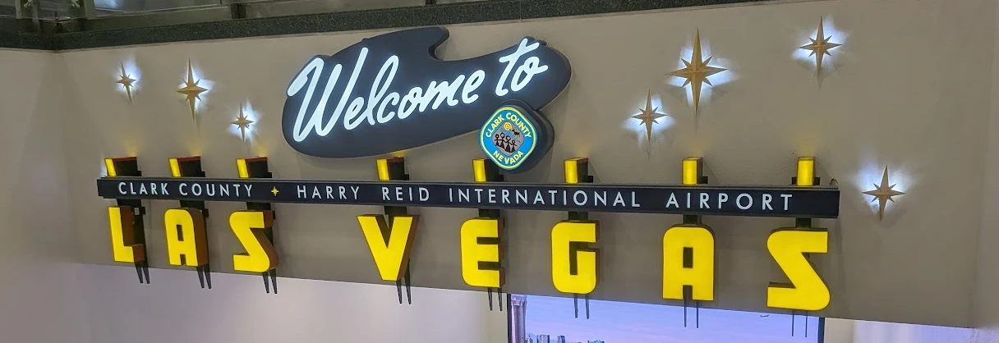
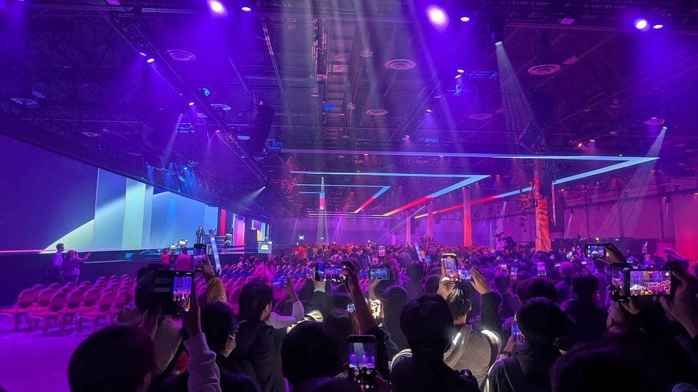
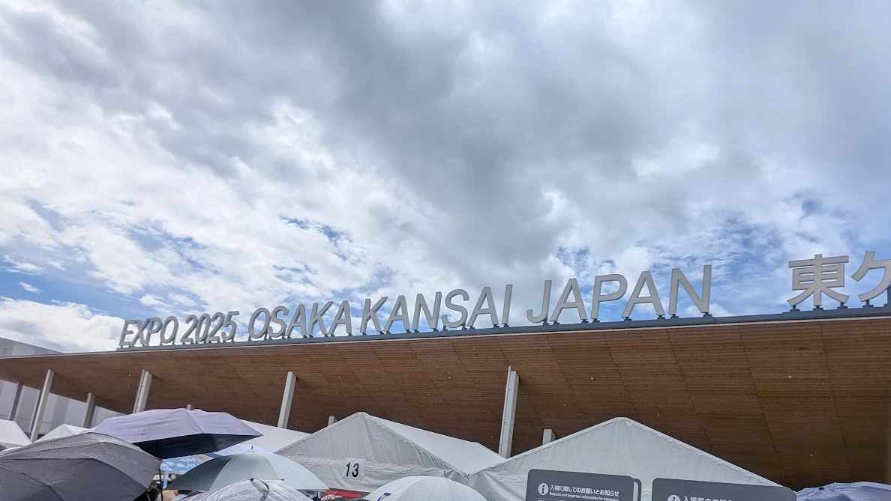
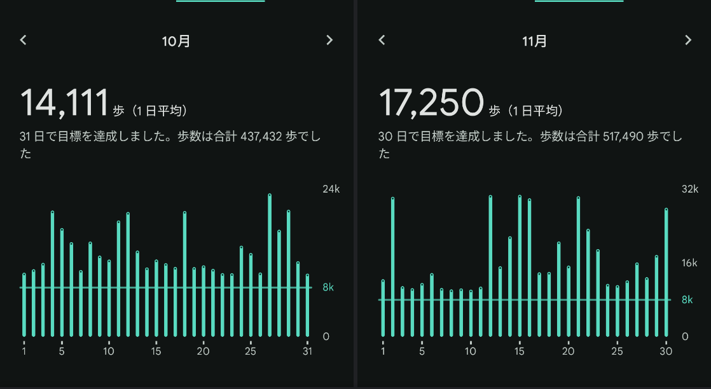

どうもこんにちは、kofuk です。  
座った瞬間ｳｨｰｰﾝって鳴り始めて、立ったらｳｨｰｰﾝの音が少し高くなるトイレあるじゃないですか、あれ何の音なんでしょうね。  

前回振り返ってから 1 年ほど経ったらしいので、振り返っていこうと思います。

## 今年あったこと

### 仕事

相変わらずグループウェアの会社でソフトウェアエンジニアをやっています。
LLM を活用した新機能を開発するのが主な業務で、今年も無事新機能を世に送り出すことができました。

LLM は主に AWS で提供されているものを使っていることもあって、AWS re:Invent に参加して情報収集もしました。

### 引っ越した

1 月頭くらいから引っ越しを検討していて、2 月終わりくらいに引っ越しをしました。
不動産屋のポジショントークによると、今年はあまり物件が出回らなかったらしいのですが、割と良さげな物件をサクッと見つけられたので良かったです。
にしてもうちのマンションは普通に空き部屋あるのは何なんだ……（？）

感想ですが、会社や駅が近くなったので、諸々の移動時間が減って快適です。
悩みとしては、駅が超近くはないことと、駅の入口からホームまでが地味に遠いことです。
人間贅沢を覚えるとキリがないですね。

来年の目標は一軒家への引っ越しです。嘘です。

### なんでもない日に大型連休を作った

6 月くらいに、なんでもない週に月曜日から金曜日まで休むことで 9 連休をでっち上げました。
旅行とかも特に行ってないので、9 日間の可処分時間がいきなり生えてきた感じでした。9 日もあれば流石にリフレッシュできました。

休みの取り方ですが、お得感を取るなら月 or 水 or 金、リフレッシュを取るなら 9 連休だと思います。
ちなみに、お得感パターンだとどこに休みを入れるかによって得られるお得感が違っていて、

- 月休み: 日曜日が終わってもあと 1 日休めるお得感
- 水休み: 金曜みたいな日が週に 2 回あるお得感
- 金休み: みんなよりも早く週末に入れるお得感

です。意味がわからんという主張は許しません。

### 旅行

今年もちょこちょこ行きました。
主な旅行先は大阪、兵庫、長崎です。大阪は（仕事を含めると）3 回行きました。  
人々と福岡の観光地を回ったので、それも実質旅行かもしれないです。

大阪は万博に 2 回行きました。
1 回目は 6 月に行ったので比較的空いていましたが、2 回目は 9 月に行ったので激混みでした。
6 月に行ったときも感覚としては激混みだったんですが、実は並ばせてくれるだけましで本当に混んでいるときは並ぶことすら許されないということを 9 月に行って知りました。

兵庫はツィメルマンのピアノリサイタルに行きました。
プログラムとしてはシューベルトの即興曲といろんな作曲家の前奏曲集という感じで、特に後半の前奏曲が良かった気がします。
ドビュッシーの前奏曲集から面白め（？）の曲を間に挟んでくる感じも面白かったです。  
ところで、演奏は素晴らしかったんですが、曲間にわざとだろってくらい観客が咳しまくっていてうるさかったです。

長崎はハウステンボスとか市内観光とかでした。
市内動き回るのは大学のとき以来なので懐かしさはあったはずなんですが、それ以上に駅周辺がナウい感じに変わっていて新鮮さの方が勝ちました。
あと、電停の名前がいくつか変わっていて、スタジアムシティの主張が強くなっていて笑いました。

### ウォーキング

10--11 月に、健康保険組合のウォーキングイベントに参加して、1 日 1 万歩を目標に歩いていました。
結果、この 2 か月間は 1 万歩以上歩いていて、3 万歩を超えた日も何日かありました。
12 月は AWS re:Invent でけっこう歩く必要があったので、体力をつけておいて良かったです。

## 来年やりたいこと

達成する気はあんまりないので、漠然とした目標にします。それじゃ駄目じゃん春風亭昇太でーす。

### このブログをもう少し更新する

去年も振り返りの記事を書くときにも思った気がするんですが、今年もほとんど更新しませんでした。
というかむしろ去年よりも減っている……。

来年はこの記事がトップページに表示されないくらいは記事を書きたいですね。

### なんでもない日に大型連休を作る

今年やって良かったのでキープです。
20 日有給があるので理論上は年間 4 回できますが、やるかどうかは別問題。

### 運動

ウォーキングイベントが終わった瞬間、予定がない日の歩数が 200 歩とかになってしまいました。
体力をつけるとよいということは分かったので、継続して運動したいです。

### Web から離れた開発

正直 Web 関係の開発はちょっと飽きていて脳汁出なくなっているみたいなところがあるので、趣向の違うことをやりたいです。（転職の意思表示ではないです）  
なんか、やることとかやり方はいろいろあるにしても出来上がるものが画一的で飽きがくるというか……。

でも Web でもブラウザの開発とかならやってみたい気もする。

## まとめ

来年もいい年になるといいですね。
